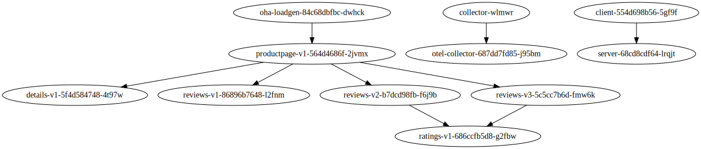

# eBPF HTTP Service Graph with Beyla

This recipe demonstrates how to configure the OpenTelemetry Collector (as deployed by the
Operator) to produce service graph metrics from [Beyla](https://github.com/grafana/beyla) spans
and send those metrics to [Google Managed Service for
Prometheus](https://cloud.google.com/stackdriver/docs/managed-prometheus). You can use the
`graphgen` script to visualize the service graph from the metrics in your GCP project.

In this recipe, Beyla is configured to collect http traces from all
workloads in the cluster without any code changes. Beyla has other features,
such as auto-instrumentation for Go applications, but this sample does not use
it for that purpose.

This recipe is based on applying a Collector config that enables the Google Cloud exporter.
It provides an `OpenTelemetryCollector` object that, when created, instructs the Operator to
create a new instance of the Collector with that config. If overwriting an existing `OpenTelemetryCollector`
object (i.e., you already have a running Collector through the Operator such as the one from the
[main README](../../README.md#starting-the-collector)), the Operator will update that existing
Collector with the new config.

## Prerequisites

> [!WARNING]  
> Beyla only works with GKE standard clusters, because GKE Auto restricts the use of privileged pods.

* Cloud Monitoring API enabled in your GCP project
* The `roles/monitoring.metricWriter`
  [IAM permissions](https://cloud.google.com/trace/docs/iam#roles) for your cluster's service
  account (or Workload Identity setup as shown below).
* A running (non-autopilot) GKE cluster
* The OpenTelemetry Operator installed in your cluster
* A Collector deployed with the Operator (recommended) or a ServiceAccount that can be used by the new Collector.
  * Note: This recipe assumes that you already have a Collector ServiceAccount named `otel-collector`,
    which is created by the operator when deploying an `OpenTelemetryCollector` object such as the
    one [in this repo](../../collector-config.yaml).
* An application already deployed that makes or serves HTTP requests:
  * Note: Beyla does not currently support HTTPS or gRPC
  * [One of the sample apps](../../sample-apps) from this repo, without auto-instrumentation enabled.

Note that the `OpenTelemetryCollector` object needs to be in the same namespace as your sample
app, or the Collector endpoint needs to be updated to point to the correct service address.

## Running

### Deploying the Recipe

Apply the role-based access control (RBAC) configurations:

```
kubectl apply -f rbac-beyla.yaml -f rbac-otel.yaml
```

This allows the Collector and Beyla to read additional metadata from the
Kubernetes API to enrich the telemetry. See [`k8sattributes`
documentation](https://github.com/open-telemetry/opentelemetry-collector-contrib/blob/v0.90.0/processor/k8sattributesprocessor/README.md#role-based-access-control)
for more information. If you are deploying the `OpenTelemetryCollector` object in a namespace
other than `default`, make sure to update the `namespace` property of the ServiceAccounts.

Apply the `OpenTelemetryCollector` object from this recipe:

```
kubectl apply -f collector-config.yaml
```

(This will overwrite any existing collector config, or create a new one if none exists.)

Once the Collector restarts, apply the Beyla Daemonset:

```
kubectl apply -f beyla-daemonset.yaml
```

This will begin creating metrics for all http traffic on each node, and exporting them to
Google Managed Service for Prometheus.

### Workload Identity Setup

If you have Workload Identity enabled, you'll see permissions errors after deploying the recipe.
You need to set up a GCP service account with permission to write traces to Cloud Trace, and allow
the Collector's Kubernetes service account to act as your GCP service account. You can do this with
the following commands:

```
export GCLOUD_PROJECT=<your GCP project ID>
gcloud iam service-accounts create otel-collector --project=${GCLOUD_PROJECT}
```

Then give that service account permission to write traces and metrics:

```
gcloud projects add-iam-policy-binding $GCLOUD_PROJECT \
    --member "serviceAccount:otel-collector@${GCLOUD_PROJECT}.iam.gserviceaccount.com" \
    --role "roles/cloudtrace.agent"
```

```
gcloud projects add-iam-policy-binding $GCLOUD_PROJECT \
    --member "serviceAccount:otel-collector@${GCLOUD_PROJECT}.iam.gserviceaccount.com" \
    --role "roles/monitoring.metricWriter"
```

Then bind the GCP service account to the Kubernetes ServiceAccount that is used by the Collector
you deployed in the prerequisites (note: set `$COLLECTOR_NAMESPACE` to the namespace you installed
the Collector in):

```
export COLLECTOR_NAMESPACE=default
gcloud iam service-accounts add-iam-policy-binding "otel-collector@${GCLOUD_PROJECT}.iam.gserviceaccount.com" \
    --role roles/iam.workloadIdentityUser \
    --member "serviceAccount:${GCLOUD_PROJECT}.svc.id.goog[${COLLECTOR_NAMESPACE}/otel-collector]"
```

**(Optional):** If you don't already have a ServiceAccount for the Collector (such as the one provided
when deploying a prior OpenTelemetryCollector object), create it with `kubectl create serviceaccount otel-collector`.

Finally, annotate the OpenTelemetryCollector Object to allow the Collector's ServiceAccount to use Workload Identity:

```
kubectl annotate opentelemetrycollector otel \
    --namespace $COLLECTOR_NAMESPACE \
    iam.gke.io/gcp-service-account=otel-collector@${GCLOUD_PROJECT}.iam.gserviceaccount.com
```

## View your Service Graph

Navigate to the Metrics explorer and look for the `traces_service_graph_request_total` metric. This
metric counts the number of calls between each pod. To visualize this metric, run the
`graphgen` script which queries the metric from your project and outputs an SVG:

```sh
cd graphgen
go run main.go -projectId="$GCLOUD_PROJECT" > graph.svg
# optionally filter on cluster and namespace
go run main.go -projectId="$GCLOUD_PROJECT" -cluster=cluster-foo -namespace=default > graph.svg
```



## Troubleshooting

### rpc error: code = PermissionDenied

An error such as the following:

```
2022/10/21 13:41:11 failed to export to Google Cloud Trace: rpc error: code = PermissionDenied desc = The caller does not have permission
```

This indicates that your Collector is unable to export spans, likely due to misconfigured IAM. Things to check:

#### GKE (cluster-side) config issues

With some configurations it's possible that the Operator could overwrite an existing ServiceAccount when deploying
a new Collector. Ensure that the Collector's service account has the `iam.gke.io/gcp-service-account` annotation after
running the `kubectl apply...` command in [Deploying the Recipe](#deploying-the-recipe). If this is missing, re-run the
`kubectl annotate` command to add it to the ServiceAccount and restart the Collector Pod by deleting it (`kubectl delete pod/otel-collector-xxx..`).

#### GCP (project-side) config issues

Double check that IAM is properly configured for Cloud Monitoring access. This includes:

* Verify the `otel-collector` service account exists in your GCP project
* That service account must have `roles/monitoring.metricWriter` permissions
* The `serviceAccount:${GCLOUD_PROJECT}.svc.id.goog[${COLLECTOR_NAMESPACE}/otel-collector]` member must also be bound
  to the `roles/iam.workloadIdentityUser` role (this identifies the Kubernetes ServiceAccount as able to use Workload Identity)
